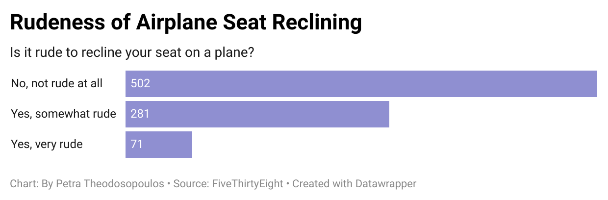

# Journalism 124 Week 4 Quiz on Data Visualization
## Flying Etiquette
### Airplane Seat Reclining

> I chose the question of whether or not it is rude to recline your seat while flying because it is always something that I wonder each time that I am on a plane. There are so many different opinions that I hear from the people in my life on this topic, and I was curious about the persepective outside of the ones that I'm already exposed to. I found it very interesting that over half of the respondents said that reclining your seat is not rude at all. I had thought there would be more people saying that it is rude.

> This chart shows obvious stronger support for the opinion that it is not rude to recline your seat on a plane. Adding together the two categories of it being rude to recline your seat still falls short of the not rude category by 150 responses. From this data it can be concluded that more people than not do not find reclining an airplane seat to be rude. 

